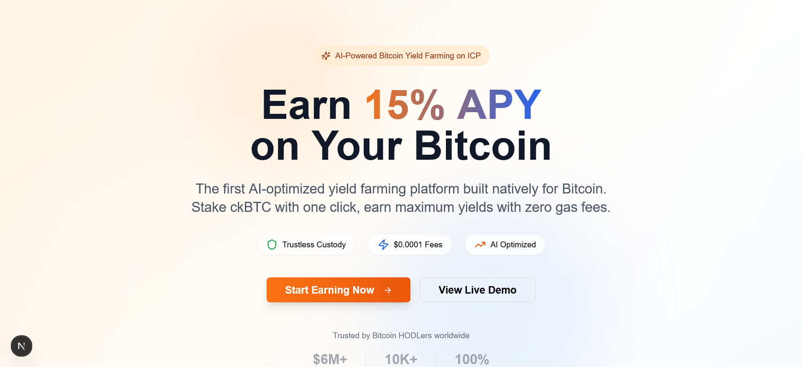

# BTC Yield - AI-Powered Bitcoin Yield Farming Platform

## 🚀 Overview

BTC Yield is the first AI-powered Bitcoin yield farming platform built natively on the Internet Computer Protocol (ICP). We enable Bitcoin HODLers to earn up to 15% APY on their ckBTC through intelligent, automated yield strategies while maintaining full custody and transparency.

### 🎯 Key Features

- **AI-Optimized Yields**: On-chain AI automatically allocates funds across lending, liquidity provision, and arbitrage
- **Ultra-Low Fees**: $0.0001 per transaction (1000x cheaper than Ethereum)
- **Trustless Custody**: Native ckBTC integration with 1:1 Bitcoin backing
- **One-Click Simplicity**: Stake with a single click, no complex vault management
- **Real-Time Transparency**: Live dashboard showing all allocations and performance
- **Community Governance**: YBTC token holders vote on strategies and earn rewards

## 🏆 Hackathon Differentiators

### vs. Yearn Finance & Convex Finance

| Feature | BTC Yield | Yearn/Convex |
|---------|-----------|--------------|
| **Gas Fees** | $0.0001 | $5-50 |
| **Minimum Stake** | 0.001 ckBTC (~$60) | 0.1+ ETH (~$300) |
| **Custody** | Trustless ckBTC | Centralized WBTC |
| **UX Complexity** | One-click staking | Multiple vault selection |
| **Transparency** | Full on-chain visibility | Black-box strategies |
| **AI Optimization** | On-chain AI model | Off-chain algorithms |

## 🛠 Tech Stack

- **Frontend**: Next.js 15 with JavaScript
- **Styling**: Tailwind CSS + shadcn/ui components
- **Blockchain**: Internet Computer Protocol (ICP)
- **Smart Contracts**: Rust-based canisters
- **Bitcoin Integration**: ckBTC for native custody
- **AI**: On-chain WebAssembly model (100MB)
- **Authentication**: Internet Identity

## 📊 Target Metrics

- **Users**: 10,000 active users within 6 months
- **TVL**: $6M+ (100 BTC at $60k/BTC)
- **APY**: Consistent 5-15% returns
- **Retention**: 70%+ user retention after 3 months
- **Cost Savings**: 90%+ transactions under $0.01

## 🎨 UI/UX Highlights

### Landing Page
- Hero section with animated stats and clear value proposition
- Feature cards highlighting AI optimization, low fees, and security
- Social proof with testimonials from Bitcoin maximalists
- Mobile-first responsive design

### Dashboard
- Clean, intuitive staking interface with risk profile selection
- Real-time portfolio overview with performance metrics
- AI strategy allocation visualization
- Recent activity feed with transaction history

### Analytics
- Interactive performance charts showing portfolio growth
- Strategy breakdown with allocation percentages
- Market insights powered by on-chain data
- Risk metrics and Sharpe ratio calculations

### Governance
- Active proposals with voting progress bars
- Voting power display with staking incentives
- Governance statistics and community metrics
- Proposal creation and delegation features

## 🚀 Getting Started

### Prerequisites
- Node.js 18+ 
- npm or yarn
- Internet Computer SDK (dfx)

### Installation

\`\`\`bash
# Clone the repository
git clone https://github.com/your-username/btc-yield-platform.git
cd btc-yield-platform

# Install dependencies
npm install

# Run development server
npm run dev
\`\`\`

Open [http://localhost:3000](http://localhost:3000) to view the application.

### Project Structure

\`\`\`
btc-yield-platform/
├── app/                    # Next.js app directory
│   ├── page.js            # Landing page
│   ├── dashboard/         # Dashboard pages
│   ├── analytics/         # Analytics pages
│   └── governance/        # Governance pages
├── components/            # Reusable components
│   ├── ui/               # shadcn/ui components
│   ├── dashboard/        # Dashboard-specific components
│   ├── analytics/        # Analytics components
│   └── governance/       # Governance components
├── lib/                  # Utility functions
└── public/              # Static assets
\`\`\`

## 🔧 Key Components

### Smart Contracts (Canisters)
- **Staking Canister**: Handles ckBTC deposits, withdrawals, and reward distribution
- **AI Canister**: Executes yield optimization algorithms using WebAssembly
- **Governance Canister**: Manages YBTC token voting and proposal execution
- **Analytics Canister**: Stores and serves performance data

### AI Model
- **Type**: Lightweight regression model for APY prediction
- **Size**: 100MB stored in canister
- **Updates**: Every 10 minutes based on market conditions
- **Transparency**: All model weights and outputs are queryable on-chain

## 🎯 User Personas

### Bitcoin HODLer (Primary)
- **Profile**: 50M+ wallet holders, $1.2T market cap
- **Goal**: Earn yield without selling Bitcoin
- **Pain Points**: High Ethereum fees, centralized custody risks
- **Solution**: Native ckBTC staking with trustless custody

### Retail DeFi User
- **Profile**: 10M+ active DeFi wallets
- **Goal**: Simple, high-yield investment options
- **Pain Points**: Complex vault selection, high minimum stakes
- **Solution**: One-click staking with micro-amounts

### Emerging Market User
- **Profile**: 1B+ unbanked individuals
- **Goal**: Access to decentralized finance
- **Pain Points**: High fees, complex interfaces
- **Solution**: Fiat on-ramps, mobile-first design

## 🔒 Security Features

- **Audited Canisters**: Smart contracts audited for common vulnerabilities
- **Canister Isolation**: Separate canisters limit attack surfaces
- **Threshold ECDSA**: Secure Bitcoin transaction signing
- **Real-time Monitoring**: Automated alerts for unusual activity

## 🌍 Roadmap

### Phase 1 (Months 1-2)
- ✅ Core canister development
- ✅ AI model training and deployment
- ✅ Frontend development with Next.js
- ✅ Internet Identity integration

### Phase 2 (Months 3-4)
- 🔄 Testnet deployment and testing
- 🔄 Security audits and bug fixes
- 🔄 Beta user onboarding
- 🔄 Fiat on-ramp integration

### Phase 3 (Months 5-6)
- 📅 Mainnet launch
- 📅 YBTC token distribution
- 📅 Governance activation
- 📅 Marketing and growth

## 🤝 Contributing

We welcome contributions from the community! Please see our [Contributing Guidelines](CONTRIBUTING.md) for details.

### Development Setup

\`\`\`bash
# Install dfx (Internet Computer SDK)
sh -ci "$(curl -fsSL https://sdk.dfinity.org/install.sh)"

# Start local replica
dfx start --background

# Deploy canisters locally
dfx deploy

# Run frontend
npm run dev
\`\`\`

## 📈 Business Model

- **Platform Fee**: 2% annual fee on staked assets
- **Performance Fee**: 10% of yields above 8% APY
- **Governance Rewards**: Fee sharing with YBTC token holders
- **Premium Features**: Advanced analytics and priority support

## 🏅 Hackathon Submission

This project is submitted for the ICP Hackathon with focus on:

1. **AI on ICP Track**: On-chain AI model for yield optimization
2. **DeFi Innovation**: Native Bitcoin integration without bridges
3. **User Experience**: Simplified interface for mainstream adoption
4. **Scalability**: Leveraging ICP's high throughput and low costs

### Demo Links
- **Live Demo**: [https://btc-yield.icp0.io]
- **Video Demo**: [YouTube Link]
- **Pitch Deck**: [Presentation Link]

## 📞 Contact

- **Team**: 
- **Email**: 
- **Twitter**: [@BTCYieldICP]
- **Discord**: [Join our community]

## 📄 License

This project is licensed under the MIT License - see the [LICENSE](LICENSE) file for details.

---

**Built with ❤️ on Internet Computer Protocol**

*Empowering Bitcoin HODLers to earn yield without compromise*
